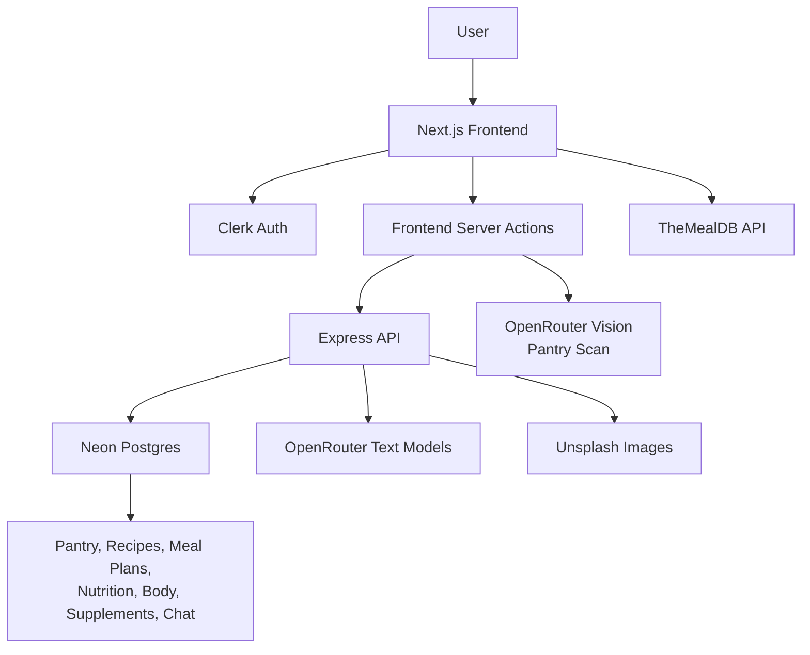
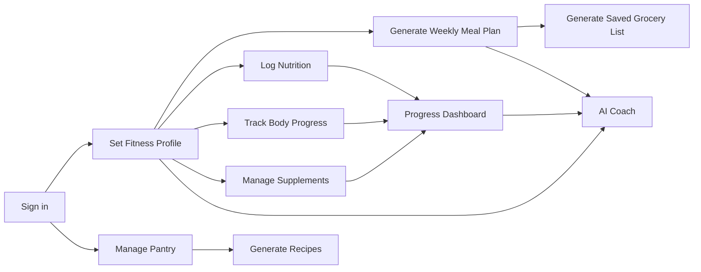

# PrepAI

PrepAI is a full-stack AI meal planning and fitness companion built as a portfolio-grade product demo. It helps authenticated users manage pantry items, generate recipes, build macro-aware weekly meal plans, save generated grocery lists, track nutrition and body progress, manage supplements, and chat with an AI fitness coach.

The goal of this project is to showcase product engineering: practical AI features, authenticated user data, database-backed persistence, mobile-first UX, and a coherent end-to-end wellness workflow.

## Highlights

- **AI pantry scanning**: Upload pantry/fridge images and extract structured ingredients.
- **AI recipe generation**: Generate full recipes with ingredients, steps, nutrition, tips, substitutions, and PDF export.
- **AI meal planning**: Generate weekly meal plans from fitness targets and workout schedule.
- **Saved grocery lists**: Generate once, persist the grocery list, and refresh only when needed to reduce repeated AI cost.
- **AI fitness coach**: Signed-in users can chat with a contextual coach informed by their profile, nutrition, body tracking, and meal plan data.
- **Fitness suite**: Fitness profile, macro targets, daily nutrition logging, body measurements, supplement tracking, and progress dashboard.
- **Responsive UX**: Mobile/tablet-focused layouts, compact health navigation, tabbed meal planner outputs, and polished mobile chat behavior.

## Why This Project Matters

PrepAI is designed to show more than UI implementation. It demonstrates:

- Product thinking around cost control, feature scope, and user workflows
- Full-stack architecture with frontend, backend, auth, database, and AI integrations
- Authenticated, user-specific data modeling
- Server-side AI orchestration and structured responses
- Responsive product UX across food, fitness, and AI surfaces
- Incremental improvement from feedback and real usability issues

## Tech Stack

### Frontend

- Next.js 16 App Router
- React 19
- Tailwind CSS 4
- Clerk authentication
- Framer Motion, GSAP, and Lenis
- shadcn/ui and Radix primitives
- Lucide icons
- Sonner toasts
- React Dropzone
- `@react-pdf/renderer`

### Backend

- Express 5
- PostgreSQL via Neon
- `pg` node-postgres driver
- Internal API-key protected backend access from frontend actions

### AI + External APIs

- OpenRouter for text and vision model calls
- TheMealDB for curated recipe discovery
- Unsplash for generated recipe imagery when configured

## Architecture



## Product Flow



## Core Features

### Pantry + Recipes

- Add, edit, delete, and clear pantry items
- Scan pantry images with AI
- Save dietary preference
- Generate recipe suggestions from available ingredients
- Browse curated recipes by category and cuisine
- Generate complete recipe detail pages
- Save recipes to a personal collection
- Export recipes as PDF

### Meal Planning

- Generate weekly meal plans from macro targets
- Configure workout days, meal count, and snacks
- View generated weekly plan in a dedicated tab
- Generate, save, and refresh grocery lists in a dedicated tab
- Shopping links for grocery items

### Fitness Tracking

- Fitness profile and macro targets
- Daily nutrition logs
- Meal history and macro summaries
- Body measurements and progress trends
- Supplement schedule and daily logging
- Progress dashboard with streaks and summary cards

### AI Coach

- Signed-in-only chat surface
- Context-aware fitness and nutrition support
- Chat history persistence
- Mobile drawer behavior with safe layering above navigation

## Repository Structure

```text
prepai/
├── frontend/
│   ├── app/                 # Next.js app routes
│   ├── actions/             # Server actions and backend calls
│   ├── components/          # Shared UI and product components
│   ├── hooks/               # Client hooks
│   └── lib/                 # Utilities and AI helpers
├── backend/
│   ├── src/
│   │   ├── routes/          # Express route handlers
│   │   ├── services/        # Business logic and AI orchestration
│   │   ├── middleware/      # Internal auth
│   │   ├── db/              # Database client and schemas
│   │   └── config/          # Environment config
│   └── package.json
└── README.md
```

## Environment Variables

### Frontend

```env
NEXT_PUBLIC_CLERK_PUBLISHABLE_KEY=
CLERK_SECRET_KEY=
NEXT_PUBLIC_CLERK_SIGN_IN_URL=/sign-in
NEXT_PUBLIC_CLERK_SIGN_UP_URL=/sign-up

BACKEND_API_URL=http://127.0.0.1:4000/api
BACKEND_INTERNAL_API_KEY=

OPENROUTER_API_KEY=
OPENROUTER_VISION_MODEL=
```

### Backend

```env
PORT=4000
DATABASE_URL=
BACKEND_INTERNAL_API_KEY=

OPENROUTER_API_KEY=
OPENROUTER_TEXT_MODEL=
UNSPLASH_ACCESS_KEY=
```

## Local Development

Install dependencies:

```bash
cd frontend
npm install

cd ../backend
npm install
```

Run database migrations:

```bash
cd backend
npm run migrate
```

Start the backend:

```bash
cd backend
npm run dev
```

Start the frontend:

```bash
cd frontend
npm run dev
```

Local URLs:

- Frontend: `http://127.0.0.1:3000`
- Backend: `http://127.0.0.1:4000`

## Verification

See [TESTING.md](./TESTING.md) for the testing strategy, current coverage, and the remaining high-value test gaps.

Frontend:

```bash
cd frontend
npm run lint
npm run build
npm run test:e2e
```

The E2E suite uses Playwright. If the runner is not installed yet, add it in the frontend workspace:

```bash
cd frontend
npm install -D @playwright/test
npx playwright install chromium
```

Backend:

```bash
cd backend
npm test
npm start
```

Manual smoke path:

1. Sign up or sign in.
2. Create a fitness profile.
3. Add pantry items manually or scan an image.
4. Generate recipe suggestions.
5. Open a recipe detail page and save/export it.
6. Generate a weekly meal plan.
7. Generate and revisit a saved grocery list.
8. Log nutrition and body measurements.
9. Add and log supplements.
10. Open the AI coach and ask a profile-aware question.

## Portfolio Demo Script

Use this flow for a 2-3 minute employer demo:

1. Start on the landing page and explain the product idea.
2. Show pantry item management and AI pantry scanning.
3. Generate recipe suggestions from pantry ingredients.
4. Open a full recipe page and show PDF export/save.
5. Move to fitness profile and macro targets.
6. Generate a weekly meal plan.
7. Switch between Weekly Plan and Grocery List tabs.
8. Show nutrition, body tracking, supplements, and progress.
9. End with the signed-in AI coach.

## Current Project Status

This project is ready to present as a portfolio showcase after deployment and final manual QA. The strongest story is not just the number of features, but the way they connect into one user workflow: pantry to recipes, profile to meal plan, meal plan to grocery list, and tracking data to AI coaching.

Recommended next polish before broad sharing:

- Add end-to-end tests for the main signed-in flows
- Add screenshots or a demo GIF to this README
- Keep a deployed demo URL and backend health URL available
- Clean migration helper scripts before final public repo publication
- Record a short walkthrough video
