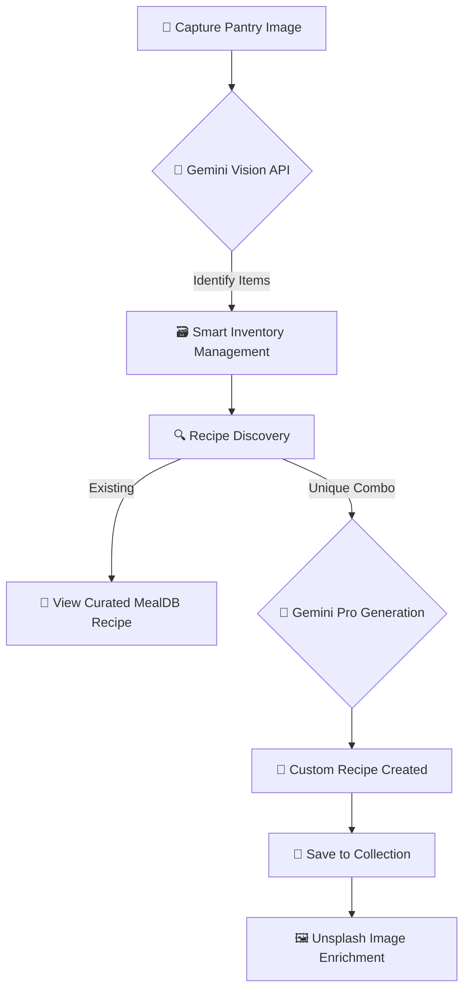

# PrepAI: The Intelligent Culinary Assistant

[](https://nextjs.org/)
[](https://deepmind.google/technologies/gemini/)
[](https://strapi.io/)
[](https://tailwindcss.com/)

PrepAI is a sophisticated full-stack application that transforms kitchen management into an AI-driven experience. By combining **Computer Vision**, **Generative AI**, and a **Headless Architecture**, PrepAI allows users to scan their physical pantry, manage inventory, and generate chef-quality recipes tailored to their exact dietary needs and available ingredients.

---

## 🗺️ User Journey Visualization



---

## 🧠 The AI Strategy: Why & How?

### 1. Computer Vision for Zero-Friction Entry
Instead of manual data entry, we utilize `gemini-2.5-flash` to analyze images. 
*   **The Approach:** We convert image buffers to Base64 and feed them to the Vision model with a strictly defined JSON schema prompt. 
*   **Benefit:** This removes the primary barrier to entry—typing out 20 ingredients.

### 2. Context-Aware Recipe Generation
PrepAI doesn't just "find" recipes; it *constructs* them.
*   **Method:** We use dynamic prompting that injects current pantry items and user-defined dietary preferences (Vegetarian, Non-Vegetarian, etc.).
*   **Logic:** The system calculates "Match Percentages," showing users exactly what they have and what 1-2 items they might be missing.

---

## 🛠️ Engineering Approach & Coding Standards

### React Coding Methods & Patterns
*   **Next.js Server Actions:** We've eliminated traditional API boilerplate. Files like `recipe.actions.js` use `"use server"` to handle complex logic (DB calls, AI generation, and external API fetching) securely on the server side.
*   **Normalization Layer:** We implemented a `normalizeTitle` helper to ensure database consistency (e.g., "apple cake" vs "Apple Cake"), preventing duplicate recipe generation.
*   **Error Boundaries & Graceful Degradation:** The Unsplash integration is designed as a "soft dependency." If the API fails or the key is missing, the recipe generation persists, ensuring a resilient user experience.

### Headless Architecture
By using **Strapi** as our backbone, we decoupled our content from our logic:
*   **Relational Mapping:** Clean relationships between `Users`, `PantryItems`, `Recipes`, and `SavedRecipes`.
*   **Scalability:** The architecture allows for easy expansion into mobile apps or other frontends using the same Strapi API.

---

## 🛡️ Challenges Solved

### Challenge: AI Hallucinations in Data Structures
**Problem:** Generative models often return conversational text when the application requires strict JSON.
**Solution:** We implemented a robust parsing wrapper in `pantry.actions.js` that uses regex to strip markdown code blocks and `JSON.parse` with try-catch blocks to ensure the UI never crashes due to malformed AI output.

### Challenge: Visual Consistency for Generated Content
**Problem:** AI-generated recipes lack visual appeal.
**Solution:** We integrated the **Unsplash API**. Every time a unique recipe is generated, the system performantly fetches a high-quality, relevant food image based on the recipe's title, making the AI content feel as premium as curated content.

### Challenge: Cold-Start Database Search
**Problem:** Searching for "Spaghetti" shouldn't trigger an expensive AI call if it's already in the DB.
**Solution:** Implemented a **Search-First pattern**. The system queries the Strapi DB with case-insensitive filters (`$eqi`) before ever invoking Gemini, reducing latency and API costs.

---

## 🚀 Tech Stack Deep Dive

*   **Frontend:** Next.js 15, Tailwind CSS, Lucide React
*   **Backend:** Strapi CMS (PostgreSQL)
*   **Intelligence:** Google Gemini AI (Vision & Pro)
*   **Images:** Unsplash API & MealDB API
*   **Authentication:** Clerk (or custom middleware via `checkUser`)

---

## 📖 Developer Journal: Reflections

Building PrepAI was an exercise in **prompt engineering** and **asynchronous state management**. 

The most interesting discovery was the balance between AI creativity and database reliability. By forcing the AI to strictly adhere to specific categories (e.g., `breakfast`, `dinner`) and cuisines, we were able to build a filterable interface that feels organized despite being powered by non-deterministic models. This project demonstrates that AI is most powerful when wrapped in traditional software engineering best practices: validation, normalization, and robust error handling.

---

## 🛠️ Getting Started

1.  **Clone & Install:**
    ```bash
    git clone https://github.com/yourusername/prepai.git
    npm install
    ```
2.  **Environment Setup:**
    Create a `.env` file:
    ```env
    GEMINI_API_KEY=your_key
    STRAPI_API_TOKEN=your_token
    NEXT_PUBLIC_STRAPI_URL=http://localhost:1337
    UNSPLASH_ACCESS_KEY=your_key
    ```
3.  **Run Development:**
    ```bash
    npm run dev
    ```

---

*Developed with ❤️ by [Your Name]*
*Focused on UX, Engineering Quality, and the Future of AI.*
