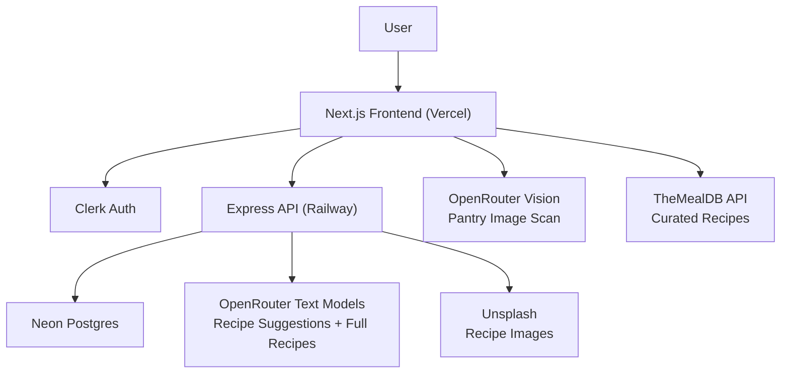
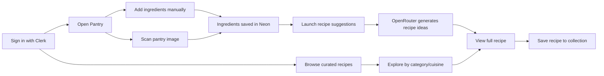

# PrepAI

[](https://nextjs.org/)
[](https://openrouter.ai/)
[](https://railway.app/)
[](https://neon.tech/)
[](https://clerk.com/)
[](https://www.themealdb.com/)

PrepAI is an AI-powered pantry and recipe app. Users can scan pantry images, manage ingredients, save preferences, generate recipe suggestions, explore curated recipes from TheMealDB, and open full recipe detail pages from the ingredients they already have.

The app runs on a modern, product-focused stack:
- `Next.js` frontend on Vercel
- `Express` backend on Railway
- `Neon Postgres` for data
- `Clerk` for auth
- `OpenRouter` for pantry vision + recipe generation
- `TheMealDB` for curated recipe discovery

## Architecture



## Product Flow



## Features

- **Pantry Management**: Add, edit, delete, and clear pantry ingredients
- **Pantry Image Scan**: AI-powered image recognition with structured ingredient extraction
- **Dietary Preferences**: Save dietary preferences per user
- **AI Recipe Suggestions**: Generate recipe ideas from current pantry items via OpenRouter
- **Full Recipe Generation**: Detailed recipes with ingredients, steps, nutrition, and tips
- **Saved Recipe Collection**: Personal cookbook with save/unsave functionality
- **Curated Recipes**: Discover recipes from TheMealDB with daily featured recipe
- **Category Browsing**: Filter recipes by category (Pasta, Dessert, Vegan, etc.)
- **Cuisine Exploration**: Browse recipes by cuisine (Italian, Mexican, Indian, etc.)
- **PDF Export**: Export recipes as PDF documents
- **Premium UI/UX**: Smooth animations with Framer Motion, GSAP, and Lenis
- **Theme Support**: Light/dark mode with next-themes
- **Responsive Design**: Mobile-first design with Tailwind CSS

## Stack

### Frontend
- **Framework**: Next.js 16
- **UI Library**: React 19
- **Styling**: Tailwind CSS 4 with PostCSS
- **UI Components**: shadcn/ui, Radix UI primitives
- **Animations**: Framer Motion, GSAP, Lenis (smooth scroll)
- **Authentication**: Clerk
- **Icons**: Lucide React
- **Toast Notifications**: Sonner
- **File Upload**: React Dropzone
- **PDF Generation**: @react-pdf/renderer
- **Theme**: next-themes
- **Utilities**: clsx, class-variance-authority, tailwind-merge

### Backend
- **Framework**: Express 5
- **Database**: Neon Postgres (Serverless Postgres)
- **Database Driver**: pg (node-postgres)
- **Environment**: dotenv

### AI + Media
- **AI Recipes & Vision**: OpenRouter
- **Curated Recipes**: TheMealDB API
- **Recipe Images**: Unsplash

## Monorepo Structure

```text
prepai/
├── frontend/          # Next.js app (Vercel)
│   ├── app/           # Next.js app router
│   ├── components/    # React components
│   ├── actions/       # Server actions
│   ├── lib/           # Utilities and data
│   └── hooks/         # Custom React hooks
├── backend/           # Express API (Railway)
│   ├── src/
│   │   ├── routes/    # API routes
│   │   ├── services/  # Business logic
│   │   ├── middleware/# Auth middleware
│   │   └── db/        # Database connection
│   └── scripts/       # Migration scripts
└── README.md
```

## Environment

### Frontend (`frontend/.env`)

```env
NEXT_PUBLIC_CLERK_PUBLISHABLE_KEY=
CLERK_SECRET_KEY=
NEXT_PUBLIC_CLERK_SIGN_IN_URL=/sign-in
NEXT_PUBLIC_CLERK_SIGN_UP_URL=/sign-up

BACKEND_API_URL=http://127.0.0.1:4000/api
BACKEND_INTERNAL_API_KEY=

OPENROUTER_API_KEY=
OPENROUTER_VISION_MODEL=openrouter/free
```

### Backend (`backend/.env`)

```env
PORT=4000
DATABASE_URL=
BACKEND_INTERNAL_API_KEY=

OPENROUTER_API_KEY=
OPENROUTER_TEXT_MODEL=openrouter/free
UNSPLASH_ACCESS_KEY=
```

## Local Development

### 1. Install dependencies

```bash
cd frontend && npm install
cd ../backend && npm install
```

### 2. Run the database schema reset/migration

```bash
cd backend
npm run migrate
```

### 3. Start the backend

```bash
cd backend
npm run dev
```

### 4. Start the frontend

```bash
cd frontend
npm run dev
```

Frontend runs on [http://127.0.0.1:3000](http://127.0.0.1:3000)  
Backend runs on `http://127.0.0.1:4000`

## Deployment

### Frontend
- Host on Vercel
- Set `BACKEND_API_URL` to your Railway backend, e.g.
  - `https://your-service.up.railway.app/api`

### Backend
- Host on Railway
- Root directory: `backend`
- Start command: `npm start`
- Healthcheck path: `/api/health`

## Database Tables

The app uses four main tables:
- `users` - User profiles (synced with Clerk)
- `pantry_items` - Pantry inventory
- `recipes` - Generated and curated recipes
- `saved_recipes` - User's saved recipe collection

## Notes

- Pantry image scan runs through OpenRouter from the frontend server action layer
- Recipe generation and recipe suggestions run through OpenRouter from the Express backend
- Curated recipes are fetched from TheMealDB API
- Clerk remains the auth source of truth; app users are created/upserted in Postgres when backend-backed flows are used
- PDF export is available for full recipes via @react-pdf/renderer
