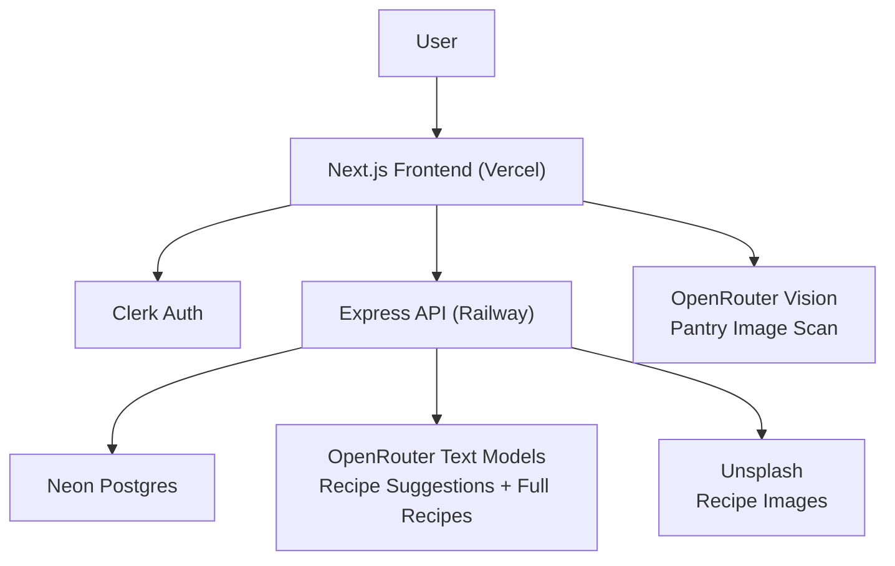
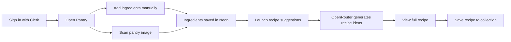

# PrepAI

[](https://nextjs.org/)
[](https://openrouter.ai/)
[](https://railway.app/)
[](https://neon.tech/)
[](https://clerk.com/)

PrepAI is an AI-powered pantry and recipe app. Users can scan pantry images, manage ingredients, save preferences, generate recipe suggestions, and open full recipe detail pages from the ingredients they already have.

The app now runs on a much simpler product-focused stack:
- `Next.js` frontend on Vercel
- `Express` backend on Railway
- `Neon Postgres` for data
- `Clerk` for auth
- `OpenRouter` for pantry vision + recipe generation

## Architecture



## Product Flow



## Features

- Pantry inventory with add, edit, delete, and clear flows
- Pantry image scan with structured ingredient extraction
- Dietary preference saving per user
- AI recipe suggestions from current pantry items
- Full recipe generation with ingredients, steps, nutrition, and tips
- Saved recipe collection
- Premium-style frontend with a cleaner product UI

## Stack

### Frontend
- Next.js 16
- React 19
- Tailwind CSS 4
- Clerk
- Sonner

### Backend
- Express 5
- pg
- Neon Postgres

### AI + Media
- OpenRouter
- Unsplash

## Monorepo Structure

```text
prepai/
├── frontend/   # Next.js app
├── backend/    # Express API
└── README.md
```

## Environment

### Frontend (`frontend/.env`)

```env
NEXT_PUBLIC_CLERK_PUBLISHABLE_KEY=
CLERK_SECRET_KEY=
NEXT_PUBLIC_CLERK_SIGN_IN_URL=/sign-in
NEXT_PUBLIC_CLERK_SIGN_UP_URL=/sign-up

BACKEND_API_URL=http://127.0.0.1:4000/api
BACKEND_INTERNAL_API_KEY=

OPENROUTER_API_KEY=
OPENROUTER_VISION_MODEL=openrouter/free
```

### Backend (`backend/.env`)

```env
PORT=4000
DATABASE_URL=
BACKEND_INTERNAL_API_KEY=

OPENROUTER_API_KEY=
OPENROUTER_TEXT_MODEL=openrouter/free
UNSPLASH_ACCESS_KEY=
```

## Local Development

### 1. Install dependencies

```bash
cd frontend && npm install
cd ../backend && npm install
```

### 2. Run the database schema reset/migration

```bash
cd backend
npm run migrate
```

### 3. Start the backend

```bash
cd backend
npm run dev
```

### 4. Start the frontend

```bash
cd frontend
npm run dev
```

Frontend runs on [http://127.0.0.1:3000](http://127.0.0.1:3000)  
Backend runs on `http://127.0.0.1:4000`

## Deployment

### Frontend
- Host on Vercel
- Set `BACKEND_API_URL` to your Railway backend, e.g.
  - `https://your-service.up.railway.app/api`

### Backend
- Host on Railway
- Root directory: `backend`
- Start command: `npm start`
- Healthcheck path: `/api/health`

## Database Tables

The app uses only four product tables:
- `users`
- `pantry_items`
- `recipes`
- `saved_recipes`

Old Strapi tables were removed from the active schema.

## Notes

- Pantry image scan runs through OpenRouter from the frontend server action layer.
- Recipe generation and recipe suggestions run through OpenRouter from the Express backend.
- Clerk remains the auth source of truth; app users are created/upserted in Postgres when backend-backed flows are used.
